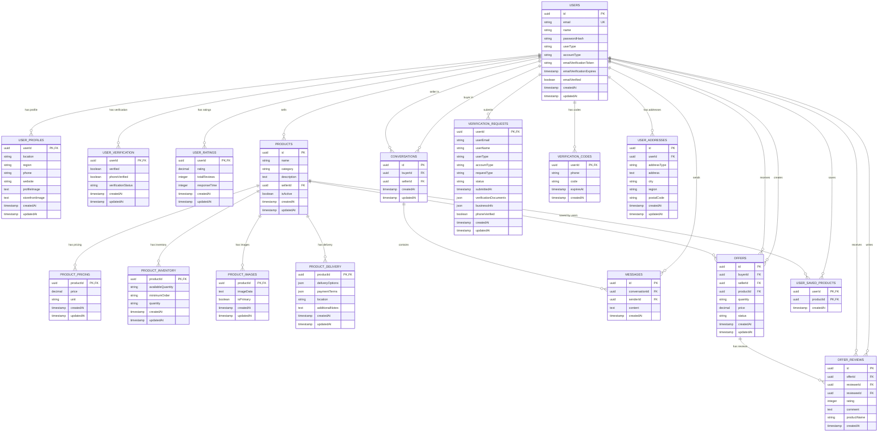

# 🗄️ AgriLink Database ERD (Entity Relationship Diagram)

> **📖 For the complete and detailed ERD with all 18 tables, relationships, and comprehensive documentation, see [DATABASE_ERD_DETAILED.md](DATABASE_ERD_DETAILED.md)**

## 📊 **Quick Reference ERD Diagram**

## 🎯 **Key Relationships**

### **Core User Relationships**
- **Users** → **User Profiles** (1:1) - Extended user information
- **Users** → **User Verification** (1:1) - Verification status
- **Users** → **User Ratings** (1:1) - Rating and review stats
- **Users** → **Products** (1:Many) - Users can sell multiple products

### **Product Relationships**
- **Products** → **Product Pricing** (1:1) - Price and unit information
- **Products** → **Product Inventory** (1:1) - Stock and order details
- **Products** → **Product Images** (1:Many) - Multiple images per product
- **Products** → **Product Delivery** (1:1) - Delivery and payment options

### **Communication Relationships**
- **Users** → **Conversations** (1:Many) - Users can have multiple conversations
- **Conversations** → **Messages** (1:Many) - Multiple messages per conversation
- **Users** → **Offers** (1:Many) - Users can create/receive multiple offers

### **Review Relationships**
- **Offers** → **Offer Reviews** (1:Many) - Multiple reviews per offer
- **Users** → **Offer Reviews** (1:Many) - Users can write/receive reviews

## 📊 **Database Statistics**

### **Table Sizes (Estimated)**
- **USERS**: ~1,000 records
- **PRODUCTS**: ~5,000 records
- **MESSAGES**: ~50,000 records
- **OFFERS**: ~10,000 records
- **PRODUCT_IMAGES**: ~15,000 records (large base64 data)

### **Key Performance Tables**
- **PRODUCTS** - Most queried table
- **MESSAGES** - Highest volume table
- **PRODUCT_IMAGES** - Largest storage consumption
- **OFFERS** - Complex relationship queries

## 🔍 **Optimization Insights**

### **High-Traffic Relationships**
1. **Products ↔ Users** - Seller information frequently joined
2. **Products ↔ Product Images** - Image loading performance critical
3. **Conversations ↔ Messages** - Real-time chat performance
4. **Offers ↔ Users** - Offer management queries

### **Index Recommendations**
- `products.sellerId` - For seller product listings
- `products.category` - For category filtering
- `messages.conversationId` - For chat performance
- `offers.status` - For offer management
- `user_profiles.location` - For location filtering

---

*This ERD provides a visual representation of the AgriLink database schema and helps identify optimization opportunities.*

