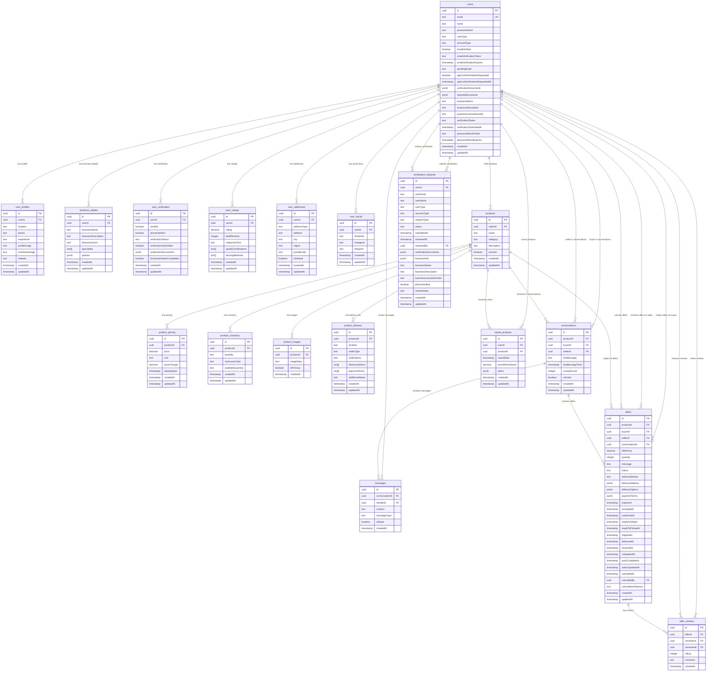

# 🗄️ AgriLink Database ERD - Comprehensive Entity Relationship Diagram

*Complete database schema documentation with all tables, relationships, and constraints for the AgriLink agricultural marketplace.*

---

## 📊 **Database Overview**

AgriLink uses a **PostgreSQL database** with **14 main tables** organized into logical groups:

- **👤 User Management** (6 tables): Users, profiles, verification, ratings, addresses, social
- **🛒 Product Management** (5 tables): Products, pricing, inventory, images, delivery
- **💬 Communication** (2 tables): Conversations, messages
- **🎯 Trading** (2 tables): Offers, reviews
- **📋 Administration** (1 table): Verification requests

---

## 🎨 **Visual ERD Diagram**

---

## 📋 **Table Details**

### **👤 User Management Tables**

#### **1. users (Core User Data)**
**Primary Key**: `id` (UUID)  
**Unique Constraints**: `email`

**Key Fields**:
- `userType`: farmer, trader, buyer, admin
- `accountType`: individual, business
- `emailVerified`: Email verification status
- `verificationDocuments`: JSON array of uploaded documents
- `businessName`: For business accounts
- `businessDescription`: Business description
- `verificationStatus`: not_started, pending, verified, rejected

**Relationships**:
- One-to-One with: user_profiles, business_details, user_verification, user_ratings
- One-to-Many with: products, conversations (as buyer/seller), messages, offers, saved_products

#### **2. user_profiles (Profile Information)**
**Primary Key**: `id` (UUID)  
**Foreign Key**: `userId` → users.id

**Key Fields**:
- `location`: User's location (required)
- `phone`: Contact phone number
- `profileImage`: Profile picture URL
- `storefrontImage`: Storefront banner image
- `website`: Business website URL

#### **3. business_details (Business Information)**
**Primary Key**: `id` (UUID)  
**Foreign Key**: `userId` → users.id

**Key Fields**:
- `businessName`: Official business name
- `businessDescription`: Detailed business description
- `businessHours`: Operating hours
- `specialties`: Array of business specialties
- `policies`: JSON object with business policies

#### **4. user_verification (Verification Status)**
**Primary Key**: `id` (UUID)  
**Foreign Key**: `userId` → users.id

**Key Fields**:
- `verified`: Overall verification status
- `phoneVerified`: Phone number verification
- `verificationStatus`: Current verification stage
- `verificationDocuments`: JSON array of verification documents
- `businessDetailsCompleted`: Business information completion

#### **5. user_ratings (User Ratings & Certifications)**
**Primary Key**: `id` (UUID)  
**Foreign Key**: `userId` → users.id

**Key Fields**:
- `rating`: Average rating (decimal 3,2)
- `totalReviews`: Total number of reviews
- `responseTime`: Typical response time
- `qualityCertifications`: Array of certifications
- `farmingMethods`: Array of farming methods

#### **6. user_addresses (User Addresses)**
**Primary Key**: `id` (UUID)  
**Foreign Key**: `userId` → users.id

**Key Fields**:
- `addressType`: home, business, delivery
- `address`: Street address
- `city`: City name
- `region`: Region/state
- `postalCode`: Postal/ZIP code
- `isDefault`: Default address flag

#### **7. user_social (Social Media Links)**
**Primary Key**: `id` (UUID)  
**Foreign Key**: `userId` → users.id

**Key Fields**:
- `facebook`: Facebook profile URL
- `instagram`: Instagram profile URL
- `telegram`: Telegram username

### **🛒 Product Management Tables**

#### **8. products (Core Product Data)**
**Primary Key**: `id` (UUID)  
**Foreign Key**: `sellerId` → users.id

**Key Fields**:
- `name`: Product name (required)
- `category`: Product category
- `description`: Detailed product description
- `isActive`: Product visibility status

**Relationships**:
- Many-to-One with: users (seller)
- One-to-One with: product_pricing, product_inventory, product_delivery
- One-to-Many with: product_images, conversations, offers, saved_products

#### **9. product_pricing (Pricing Information)**
**Primary Key**: `id` (UUID)  
**Foreign Key**: `productId` → products.id

**Key Fields**:
- `price`: Product price (decimal 12,2)
- `unit`: Price unit (kg, piece, etc.)
- `priceChange`: Price change percentage
- `lastUpdated`: Last price update timestamp

#### **10. product_inventory (Stock Information)**
**Primary Key**: `id` (UUID)  
**Foreign Key**: `productId` → products.id

**Key Fields**:
- `quantity`: Total available quantity
- `minimumOrder`: Minimum order quantity
- `availableQuantity`: Currently available stock

#### **11. product_images (Product Images)**
**Primary Key**: `id` (UUID)  
**Foreign Key**: `productId` → products.id

**Key Fields**:
- `imageData`: Base64 image data or URL
- `isPrimary`: Primary image flag

#### **12. product_delivery (Delivery Information)**
**Primary Key**: `id` (UUID)  
**Foreign Key**: `productId` → products.id

**Key Fields**:
- `location`: Delivery location
- `sellerType`: Type of seller (farmer, trader)
- `sellerName`: Seller display name
- `deliveryOptions`: Array of delivery methods
- `paymentTerms`: Array of accepted payment methods
- `additionalNotes`: Additional delivery notes

### **💬 Communication Tables**

#### **13. conversations (Chat Conversations)**
**Primary Key**: `id` (UUID)  
**Foreign Keys**: 
- `productId` → products.id
- `buyerId` → users.id
- `sellerId` → users.id

**Key Fields**:
- `lastMessage`: Last message content
- `lastMessageTime`: Last message timestamp
- `unreadCount`: Number of unread messages
- `isActive`: Conversation active status

**Relationships**:
- Many-to-One with: products, users (buyer), users (seller)
- One-to-Many with: messages, offers

#### **14. messages (Chat Messages)**
**Primary Key**: `id` (UUID)  
**Foreign Keys**:
- `conversationId` → conversations.id
- `senderId` → users.id

**Key Fields**:
- `content`: Message content
- `messageType`: text, image, file, offer
- `isRead`: Message read status

### **🎯 Trading Tables**

#### **15. offers (Trade Offers)**
**Primary Key**: `id` (UUID)  
**Foreign Keys**:
- `productId` → products.id
- `buyerId` → users.id
- `sellerId` → users.id
- `conversationId` → conversations.id
- `cancelledBy` → users.id

**Key Fields**:
- `offerPrice`: Proposed price (decimal 10,2)
- `quantity`: Offered quantity
- `message`: Offer message
- `status`: pending, accepted, rejected, to_ship, shipped, to_receive, completed, cancelled, expired
- `deliveryOptions`: JSON array of delivery options
- `paymentTerms`: JSON array of payment terms
- `expiresAt`: Offer expiration timestamp
- Multiple status timestamps for tracking offer lifecycle

#### **16. offer_reviews (Offer Reviews)**
**Primary Key**: `id` (UUID)  
**Foreign Keys**:
- `offerId` → offers.id
- `reviewerId` → users.id (person writing review)
- `revieweeId` → users.id (person being reviewed)

**Key Fields**:
- `rating`: Review rating (1-5)
- `comment`: Review comment text

### **📋 Administration Tables**

#### **17. verification_requests (Verification Requests)**
**Primary Key**: `id` (UUID)  
**Foreign Keys**:
- `userId` → users.id
- `reviewedBy` → users.id (admin)

**Key Fields**:
- `userEmail`: User's email address
- `userName`: User's display name
- `userType`: User type
- `accountType`: Account type
- `requestType`: Type of verification request
- `status`: pending, approved, rejected
- `verificationDocuments`: JSON array of submitted documents
- `businessInfo`: JSON object with business information
- `reviewNotes`: Admin review notes

### **💾 Utility Tables**

#### **18. saved_products (Saved Products)**
**Primary Key**: `id` (UUID)  
**Foreign Keys**:
- `userId` → users.id
- `productId` → products.id

**Key Fields**:
- `savedDate`: When product was saved
- `priceWhenSaved`: Price at time of saving
- `alerts`: JSON object with alert settings

---

## 🔗 **Key Relationships**

### **User Relationships**
- **One User** → **One Profile** (1:1)
- **One User** → **Many Products** (1:M)
- **One User** → **Many Conversations** (as buyer/seller) (1:M)
- **One User** → **Many Offers** (as buyer/seller) (1:M)
- **One User** → **Many Messages** (1:M)
- **One User** → **Many Reviews** (given/received) (1:M)

### **Product Relationships**
- **One Product** → **One Pricing** (1:1)
- **One Product** → **One Inventory** (1:1)
- **One Product** → **Many Images** (1:M)
- **One Product** → **One Delivery Info** (1:1)
- **One Product** → **Many Conversations** (1:M)
- **One Product** → **Many Offers** (1:M)

### **Communication Relationships**
- **One Conversation** → **Many Messages** (1:M)
- **One Conversation** → **Many Offers** (1:M)
- **One Conversation** → **One Product** (M:1)
- **One Conversation** → **One Buyer** (M:1)
- **One Conversation** → **One Seller** (M:1)

### **Trading Relationships**
- **One Offer** → **Many Reviews** (1:M)
- **One Offer** → **One Product** (M:1)
- **One Offer** → **One Buyer** (M:1)
- **One Offer** → **One Seller** (M:1)
- **One Offer** → **One Conversation** (M:1)

---

## 📊 **Database Statistics**

### **Table Count by Category**:
- **User Management**: 7 tables
- **Product Management**: 5 tables
- **Communication**: 2 tables
- **Trading**: 2 tables
- **Administration**: 1 table
- **Utility**: 1 table

### **Total Tables**: 18

### **Key Constraints**:
- **Primary Keys**: All tables use UUID primary keys
- **Foreign Keys**: All relationships use CASCADE DELETE
- **Unique Constraints**: Email addresses, default addresses
- **Check Constraints**: Rating values (1-5), status enums
- **Indexes**: Email, user types, product categories, conversation participants

---

## 🎯 **Database Design Principles**

### **Normalization**
- **3rd Normal Form**: Eliminated transitive dependencies
- **Separated Concerns**: User data, product data, communication data
- **Atomic Values**: Each field contains single, indivisible values

### **Performance Optimizations**
- **UUID Primary Keys**: Distributed system friendly
- **JSONB Fields**: Flexible document storage with indexing
- **Array Fields**: Efficient storage for lists
- **Proper Indexing**: On frequently queried columns

### **Scalability Features**
- **CASCADE DELETE**: Maintains referential integrity
- **Timestamp Tracking**: Audit trail for all entities
- **Soft Delete Support**: via isActive flags
- **Flexible Schema**: JSONB for extensibility

---

*This ERD provides a comprehensive view of the AgriLink database structure, enabling developers to understand relationships, optimize queries, and extend the system effectively.*

